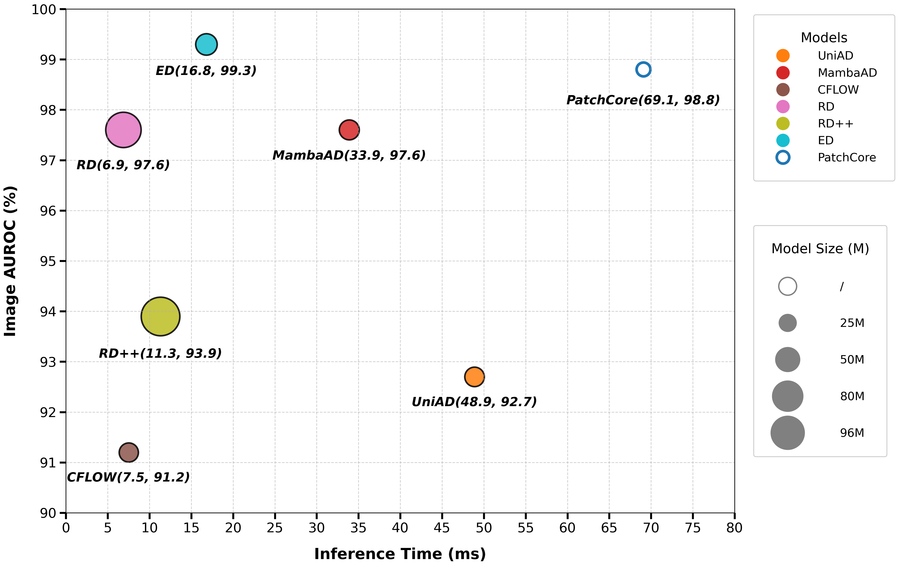

# Emphasizing Differences
Official Emphasizing Differences repository

## Introduction

<p align="center">
    
</p>

we propose a novel anomaly detection framework called Emphasize Differences (ED), which performs feature reconstruction by jointly learning intra-image and inter-image differences. Inspired by human visual discrepancy detection, the ED framework explicitly amplifies these two types of differential signals during feature reconstruction. It achieves this through dual-path encoding: intra-image differences are captured via self-supervised constraints to identify local anomalies that disrupt structural consistency, while inter-image differences are modeled by a contrastive memory module that aligns reconstructed features with normal prototypes, thereby isolating anomalous responses in latent space.

### Method

<p align="center">
    
</p>

In this work, we propose a novel anomaly detection framework called Emphasize Differences (ED), which addresses the "learning shortcut" problem in reconstruction-based methods by simultaneously modeling feature discrepancies within individual samples and variations across different samples.  The ED framework begins by extracting multi-scale feature maps from input images using a CNN backbone pre-trained on ImageNet. These reference features, combined with the training data, are then processed by a Transformer network. The 2D input images are first transformed into a high-dimensional feature space via an Embedding2D module. Next, the features are passed through a deep network consisting of Difference-Aware Attention and D2Fusion blocks, which progressively learn both intra-sample relationships and inter-sample feature correlations.

### Results

<p align="center">
    
</p>

## Dependencies

- tqdm == 4.66.6
- numpy == 1.24.4
- matplotlib == 3.5.0
- scipy == 1.9.3
- scikit-learn == 1.1.3
- pandas == 2.0.3
- pillow == 9.1.0
- torch == 1.13.1
- torchvision == 0.14.1
- timm == 0.6.12
- huggingface-hub == 0.26.2

## Creating Distance Maps
```
python create_distance_maps.py 
```

## Creating Reference Features
```bash
#  MVTecAD
python create_ref_features.py --dataset mvtec --data_path xxx --backbone_arch xxx --save_path xxx
#  BTAD
python create_ref_features.py --dataset btad --data_path xxx --backbone_arch xxx --save_path xxx
#  MVTec3D-RGB
python create_ref_features.py --dataset mvtec3d --data_path xxx --backbone_arch xxx --save_path xxx
```


## Training and Evaluating

```bash
python main.py --dataset mvtec --data_path /path/to/your/dataset --backbone_arch xxx --rfeatures_path xxx --with_intra --with_inter --save_prefix xxx
```
```bash
python main.py --dataset btad --data_path /path/to/your/dataset --backbone_arch xxx --rfeatures_path xxx --with_intra --with_inter --save_prefix xxx
```
```bash
python main.py --dataset mvtec3d --data_path /path/to/your/dataset --backbone_arch xxx --rfeatures_path xxx --with_intra --with_inter --save_prefix xxx
```

## Acknowledgements
Thanks for the great efforts from [FOD](https://github.com/xcyao00/FOD).
